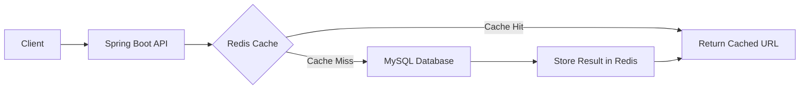
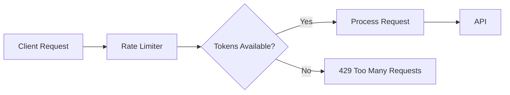
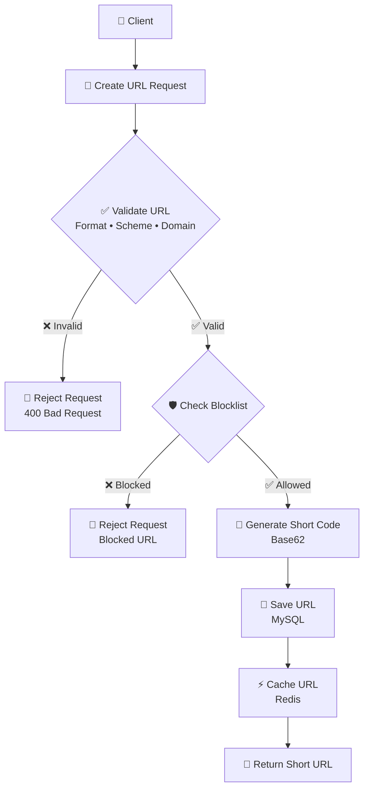
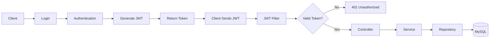
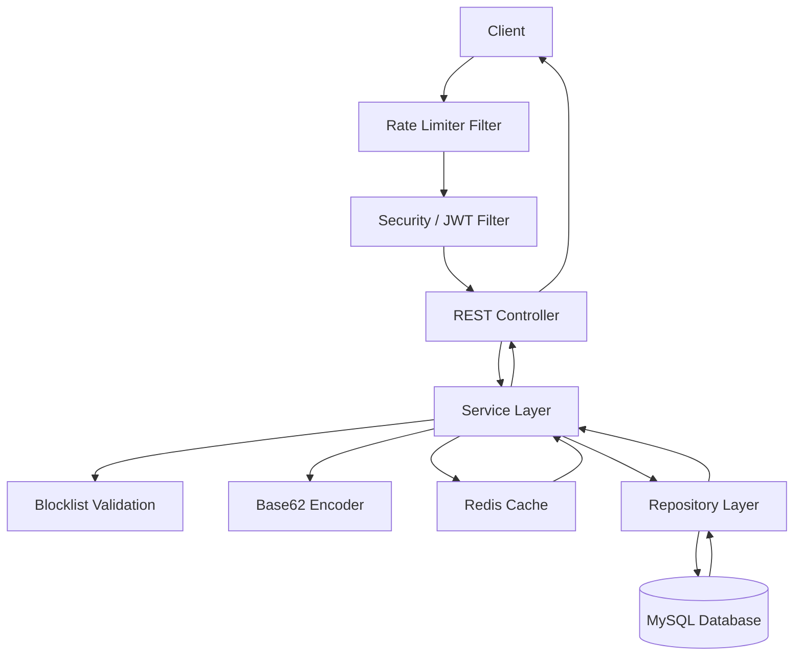
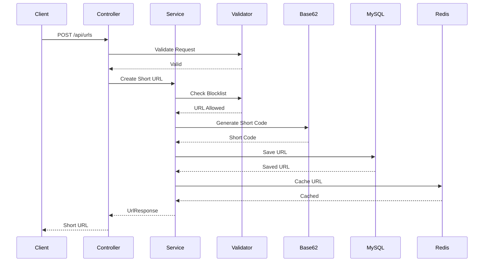
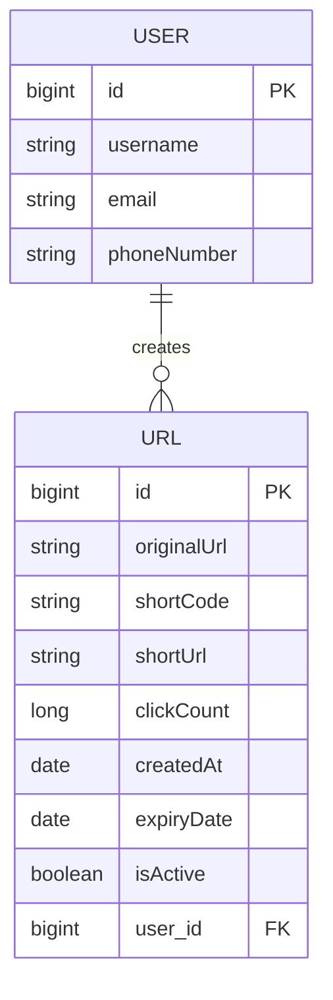

<div align="center">

# 🔗 URL Shortener

### Production-Ready URL Shortening Backend Using Spring Boot

*A secure, scalable, and high-performance RESTful backend for creating, managing, and redirecting shortened URLs with Redis caching, rate limiting, blocklist validation, Base62 encoding, JWT authentication, Flyway migrations, and Docker support.*

<br>


<br>

[Overview](#-overview) •
[Features](#-key-features) •
[Architecture](#-architecture) •
[Installation](#-installation) •
[API](#-api-endpoints) •
[Security](#-security) •
[Docker](#-docker)

</div>

---

------------------------------------------------------------------------

## 📑 Table of Contents

-   [Overview](#-overview)
-   [Key Features](#-key-features)
    -   [URL Shortening](#-url-shortening)
    -   [Base62 Encoding](#-base62-encoding)
    -   [Redis Caching](#-redis-caching)
    -   [Rate Limiting](#-rate-limiting)
    -   [Blocklist Validation](#-blocklist-validation)
    -   [Authentication](#-authentication)
    -   [Database Migration](#-database-migration)
-   [Architecture](#-architecture)
-   [URL Shortening Flow](#-url-shortening-flow)
-   [Database Schema](#-database-schema)
-   [Project Structure](#-project-structure)
-   [Prerequisites](#-prerequisites)
-   [Installation](#-installation)
-   [Application Configuration](#-application-configuration)
-   [API Endpoints](#-api-endpoints)
-   [Swagger API Documentation](#-swagger-api-documentation)
-   [Docker](#-docker)
-   [Database Migration](#-database-migration)
-   [Testing](#-testing)
-   [Error Handling](#-error-handling)
-   [Future Enhancements](#-future-enhancements)
-   [Author](#-author)

------------------------------------------------------------------------

## 🔗 Overview

The **URL Shortener** is a backend application built with **Java and
Spring Boot** that converts long URLs into compact, easy-to-share short
URLs.

The application is designed with production-oriented backend concepts
such as **REST APIs, Base62 encoding, Redis caching, distributed rate
limiting, URL validation, blocklist protection, JWT authentication,
database migration with Flyway, Docker containerization, and
OpenAPI/Swagger documentation**.

The system stores URL metadata such as the original URL, generated short
code, short URL, click count, creation date, expiration date, active
status, and associated user.

------------------------------------------------------------------------

# ✨ Key Features

## 🔗 URL Shortening

-   Convert long URLs into short URLs.
-   Generate compact short codes using **Base62 encoding**.
-   Support custom aliases.
-   Track URL click counts.
-   Support URL expiration.
-   Enable or disable shortened URLs.
-   Associate URLs with users.
-   Validate incoming URL data using DTO validation.

------------------------------------------------------------------------

## 🔢 Base62 Encoding

The project uses Base62 encoding to generate compact short codes.

The Base62 alphabet is:

``` text
0123456789abcdefghijklmnopqrstuvwxyzABCDEFGHIJKLMNOPQRSTUVWXYZ
```

This provides **62 possible characters** for each position.

For example:

``` text
0  → 0
9  → 9
10 → a
35 → z
36 → A
61 → Z
62 → 10
63 → 11
```

Base62 is useful for URL shortening because it produces shorter
human-readable strings than representing the same numeric value using
decimal digits.

------------------------------------------------------------------------

## ⚡ Redis Caching

Redis is used to improve performance by caching frequently accessed URL
information and blocklist validation results.

Typical flow:



Benefits include:

-   Faster URL lookup.
-   Reduced database load.
-   Lower latency for frequently accessed short URLs.
-   Cached blocklist validation results.

------------------------------------------------------------------------

## 🚦 Rate Limiting

The application uses **Bucket4j with Redis** for rate limiting.

Rate limits can be applied according to different client types, such as:

``` text
ANONYMOUS
AUTHENTICATED_USER
API_KEY
```

Conceptually:



Redis allows rate-limit state to be shared when the application is
running across multiple instances.

------------------------------------------------------------------------

## 🛡️ Blocklist Validation

The application validates URLs against a blocklist before allowing them
to be shortened.

A custom validation approach is used for URL safety checks.

Example concept:


Redis can cache blocklist results to avoid repeatedly checking the same
URL.

------------------------------------------------------------------------

## 🔐 Authentication

The application supports authenticated API access using JWT-based
authentication.

The general authentication flow is:



Protected endpoints require a valid JWT token.

------------------------------------------------------------------------

## 🗄️ Database Migration

**Flyway** is used for database version control.

Migration scripts are stored under:

``` text
src/main/resources/db/migration/
```

Example:

``` text
V1__create_users_table.sql
V2__create_urls_table.sql
V3__add_expiry_date.sql
```

Flyway ensures that database changes are applied in a controlled and
repeatable manner.

------------------------------------------------------------------------

# 🏗️ Architecture

The project follows a layered Spring Boot architecture.
## Request Pipeline

Rate limiting and security run as filters **before** the controller.


## 🏗️ Main Layers

| # | Layer | Responsibility | Package | Example Class |
|:-:|:------|:---------------|:--------|:--------------|
| 1 | 🌐 **Controller** | Handles HTTP requests and responses | `controller` | `UrlController` |
| 2 | 📦 **DTO** | Request and response data transfer | `dto` | `CreateUrlRequest` |
| 3 | ⚙️ **Service** | Business logic | `service` | `UrlService` |
| 4 | 🗄️ **Repository** | Database access | `repository` | `UrlRepository` |
| 5 | 🧱 **Entity** | Database models | `entity` | `UrlMapping` |
| 6 | 🔐 **Security** | Authentication and authorization | `security` | `JwtAuthFilter` |
| 7 | 🧰 **Util** | Utility components such as Base62 encoding | `util` | `Base62Encoder` |
| 8 | 🚨 **Exception** | Centralized exception handling | `exception` | `GlobalExceptionHandler` |
| 9 | ⚡ **Cache** | Redis caching and invalidation | `cache` | `UrlCacheService` |
| 10 | 🛠️ **Configuration** | Application and infrastructure configuration | `config` | `RedisConfig` |

---

> **Request flow:** Client → Security → Controller → Service → Cache / Repository → Database
# 🔄 URL Shortening Flow



------------------------------------------------------------------------

# 🗄️ Database Schema

The main entities are **User** and **Url**.


------------------------------------------------------------------------

# 🌳 Project Structure

``` text
URL_Shortner
│
├── src
│   ├── main
│   │   ├── java
│   │   │   └── com.URI.URL_Shortner
│   │   │
│   │   │   ├── Configuration
│   │   │   │   ├── OpenAPIConfig.java
│   │   │   │   ├── RedisConfig.java
│   │   │   │   ├── RateLimitConfig.java
│   │   │   │   └── ...
│   │   │   │
│   │   │   ├── Controller
│   │   │   │   └── ...
│   │   │   │
│   │   │   ├── Dto
│   │   │   │   ├── Request
│   │   │   │   └── Response
│   │   │   │
│   │   │   ├── Entity
│   │   │   │   ├── User.java
│   │   │   │   └── Url.java
│   │   │   │
│   │   │   ├── Repository
│   │   │   │   ├── UserRepository.java
│   │   │   │   └── UrlRepository.java
│   │   │   │
│   │   │   ├── Service
│   │   │   │   ├── UrlService.java
│   │   │   │   ├── BlocklistCacheService.java
│   │   │   │   ├── CacheService.java
│   │   │   │   └── ...
│   │   │   │
│   │   │   ├── Security
│   │   │   │   ├── JwtAuthenticationFilter.java
│   │   │   │   └── ...
│   │   │   │
│   │   │   ├── Util
│   │   │   │   └── Base62Encoder.java
│   │   │   │
│   │   │   ├── Exception
│   │   │   │   ├── GlobalExceptionHandler.java
│   │   │   │   └── ...
│   │   │   │
│   │   │   └── URLShortnerApplication.java
│   │   │
│   │   └── resources
│   │       ├── db
│   │       │   └── migration
│   │       │       └── V1__initial_schema.sql
│   │       ├── application.properties
│   │       └── application.yml
│   │
│   └── test
│       └── java
│           └── com.URI.URL_Shortner
│               ├── Service
│               ├── Controller
│               └── Util
│
├── Dockerfile
├── docker-compose.yml
├── pom.xml
├── README.md
└── .gitignore
```

------------------------------------------------------------------------

# ✅ Prerequisites

Make sure the following are installed:

| Tool | Version |
|:-----|:--------|
| ☕ **Java** | 21+     |
| 🏗️ **Spring Boot** | 4.x     |
| 📦 **Maven** | 3.9+    |
| 🐬 **MySQL** | latest  |
| ⚡ **Redis** | 8       |
| 🐳 **Docker** | 24+     |
| 🧩 **Docker Compose** | 2+      |
------------------------------------------------------------------------

# 🚀 Installation

## 1️⃣ Clone Repository

``` bash
git clone https://github.com/indrajit-maity/Tiny_URL.git
cd URL_Shortner
```

## 2️⃣ Build the Project

``` bash
mvn clean install
```

To skip tests:

``` bash
mvn clean install -DskipTests
```

## 3️⃣ Configure MySQL

Create the database:

``` sql
CREATE DATABASE urlshortener;
```

Configure your database connection in `application.properties` or
`application.yml`.

Example:

``` properties
spring.datasource.url=jdbc:mysql://localhost:3306/urlshortener
spring.datasource.username=root
spring.datasource.password=root
```

## 4️⃣ Start Redis

If Redis is installed locally:

``` bash
redis-server
```

Or use Docker:

``` bash
docker run -d \
  --name urlshortener-redis \
  -p 6379:6379 \
  redis:8
```

## 5️⃣ Run the Application

``` bash
mvn spring-boot:run
```

The application will start on the configured server port.

------------------------------------------------------------------------

# ⚙️ Application Configuration

Example configuration:

``` properties
spring.application.name=URL_Shortner

spring.datasource.url=jdbc:mysql://localhost:3306/urlshortener
spring.datasource.username=root
spring.datasource.password=root

spring.jpa.hibernate.ddl-auto=validate

spring.flyway.enabled=true
spring.flyway.locations=classpath:db/migration

spring.data.redis.host=localhost
spring.data.redis.port=6379
```

> Do not commit production credentials, JWT secrets, database passwords,
> API keys, or other sensitive configuration values to GitHub.

------------------------------------------------------------------------

# 📡 API Endpoints

> Base URL: `http://localhost:8081/api`
## 🔐 Authentication

| Method | Endpoint           | Description |
|:------:|:-------------------|:------------|
| `POST` | `/api/auth/signUp` | Register a user |
| `POST` | `/api/auth/login`  | Authenticate and receive JWT |

## 🔗 URL Management

| Method | Endpoint | Description |
|:------:|:---------|:------------|
| `POST` | `/api/urls` | Create a shortened URL |
| `GET` | `/api/urls/{shortCode}` | Retrieve URL information |
| `DELETE` | `/api/urls/{shortCode}` | Delete/deactivate a URL |
| `GET` | `/{shortCode}` | Redirect to original URL |
> Update the endpoint paths above if your controller mappings use
> different routes.

------------------------------------------------------------------------

# 📖 Swagger API Documentation

The project uses **Springdoc OpenAPI / Swagger UI** for interactive API
documentation.

After starting the application, open:

``` text
http://localhost:8080/swagger-ui/index.html
```

The Swagger interface can be used to:

-   Explore REST endpoints.
-   View request and response schemas.
-   Execute API requests.
-   Test authentication-protected endpoints.
-   Provide a JWT using the **Authorize** button when the OpenAPI
    security scheme is configured.

------------------------------------------------------------------------

# 🐳 Docker

## Build Application Image

``` bash
docker build -t url-shortener:latest .
```

## Run MySQL

``` bash
docker run -d \
  --name urlshortener-mysql \
  -e MYSQL_DATABASE=urlshortener \
  -e MYSQL_ROOT_PASSWORD=root \
  -p 3306:3306 \
  -v mysql_data:/var/lib/mysql \
  mysql:latest
```

## Run Redis

``` bash
docker run -d \
  --name urlshortener-redis \
  -p 6379:6379 \
  redis:latest
```

## Run Spring Boot Application

``` bash
docker run -d \
  --name urlshortener-app \
  -p 8080:8080 \
  url-shortener:latest
```

------------------------------------------------------------------------

# 🐳 Docker Compose

The project can also run its infrastructure using Docker Compose.

Start the services:

``` bash
docker compose up -d
```

Rebuild after code changes:

``` bash
docker compose up --build -d
```

Check running services:

``` bash
docker compose ps
```

View logs:

``` bash
docker compose logs -f
```

Stop services:

``` bash
docker compose down
```

------------------------------------------------------------------------

# 🗄️ Database Migration

Flyway manages database schema versions.

Migration files are placed in:

``` text
src/main/resources/db/migration/
```

Example:

``` text
V1__create_user_table.sql
V2__create_url_table.sql
V3__add_expiry_date.sql
```

Run the application normally and Flyway will apply pending migrations.

To inspect Flyway history:

``` sql
SELECT *
FROM flyway_schema_history;
```

------------------------------------------------------------------------

# 🔐 Security

The application includes several security layers:

### JWT Authentication

Authenticated requests use JWT tokens.

``` http
Authorization: Bearer <your-jwt-token>
```

### URL Validation

Incoming URLs are validated before being stored.

### Blocklist Protection

URLs can be checked against a blocklist to prevent storing blocked
destinations.

### Rate Limiting

Bucket4j and Redis can restrict excessive requests.

### Input Validation

DTOs use validation annotations such as:

``` java
@NotBlank
@URL
@Size
@Pattern
```

### Secret Management

Sensitive values should be supplied through environment variables or
external configuration rather than committed to source control.

------------------------------------------------------------------------

# 🧪 Testing

Run the complete test suite:

``` bash
mvn test
```

Run a specific test class:

``` bash
mvn -Dtest=Base62EncoderTest test
```

The project can include unit tests for:

-   Base62 encoding.
-   URL service business logic.
-   Repository interactions.
-   Rate limiting.
-   Blocklist validation.
-   Authentication.
-   Controller endpoints.

Example Base62 test:

``` java
@Test
void encode_zero_returnsFirstCharacterOfAlphabet() {
    assertEquals("0", Base62Encoder.encode(0));
}
```

For service-layer tests, **JUnit 5 and Mockito** can be used to mock
repositories and external dependencies.

------------------------------------------------------------------------

# ⚠️ Error Handling

The application uses centralized exception handling to return consistent
API responses.

Example:

``` json
{
  "timestamp": "2026-09-24T10:30:00Z",
  "status": 404,
  "error": "Not Found",
  "message": "Short URL not found",
  "path": "/abc123"
}
```

## 📊 HTTP Status Codes

| Status | Meaning |
|:------:|:--------|
| `200` | ✅ Request successful |
| `201` | 🆕 Resource created |
| `400` | ⚠️ Invalid request |
| `401` | 🔑 Authentication required/invalid |
| `403` | 🚫 Access denied |
| `404` | 🔍 Resource not found |
| `409` | ⚔️ Resource conflict |
| `429` | ⏱️ Rate limit exceeded |
| `500` | 💥 Internal server error |
------------------------------------------------------------------------

------------------------------------------------------------------------

---

## 👤 Author

<div align="center">

**Indrajit Maity**

<a href="https://github.com/indrajit-maity">
  
</a>
&nbsp;
<a href="https://www.linkedin.com/in/indrajit-maity-2a7061285/">
  
</a>
&nbsp;
<a href="mailto:2005indrajitmaity@gmail.com">
  
</a>

</div>
------------------------------------------------------------------------
